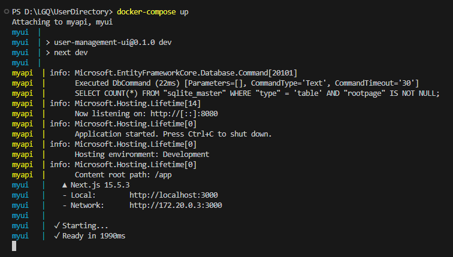
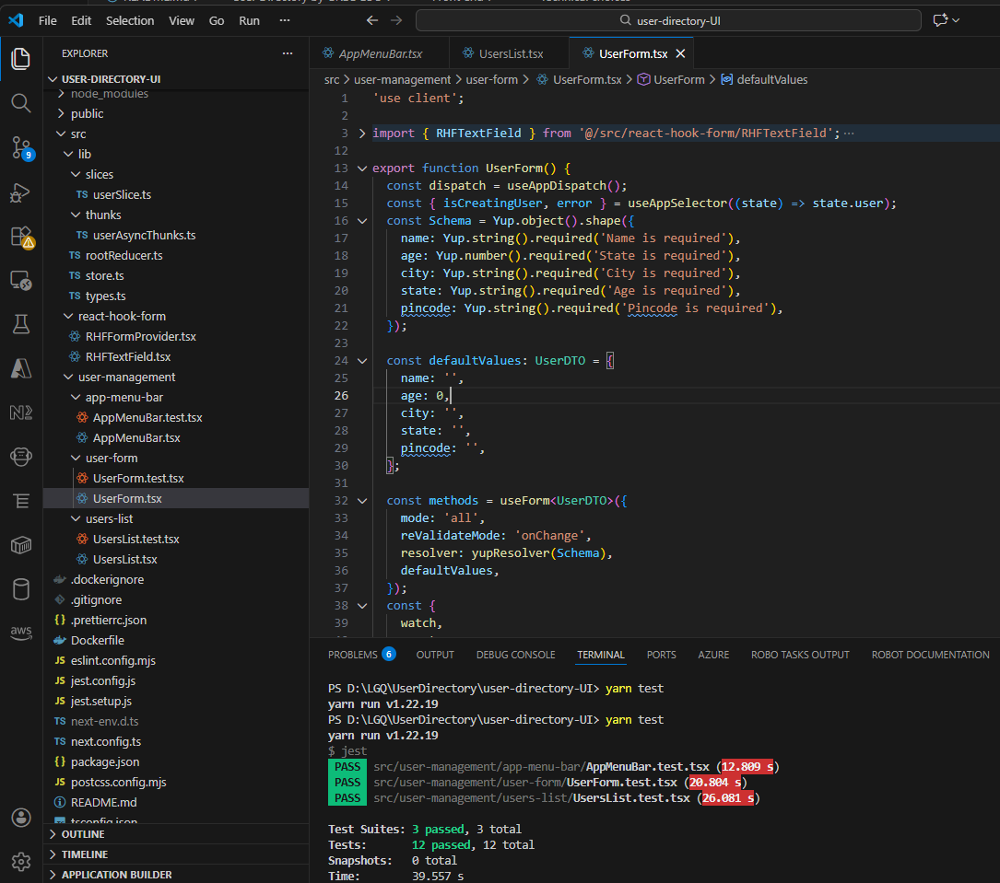
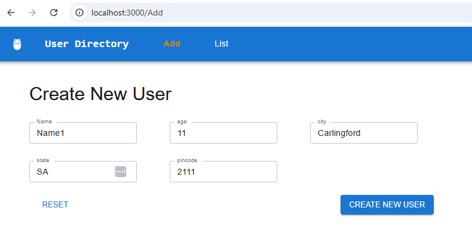
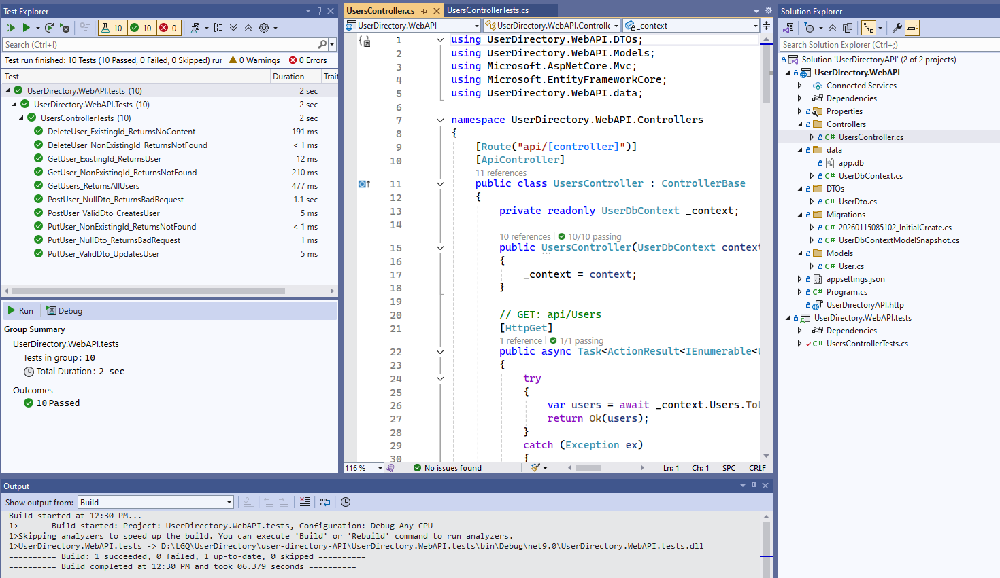
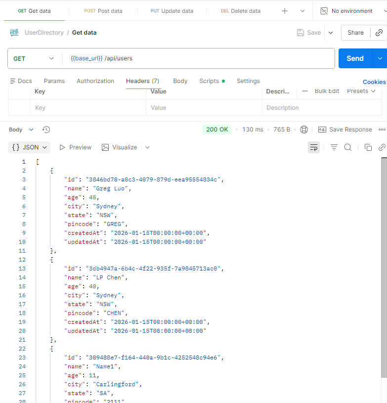

# User Directory by GREG LUO
greg.luo@outlook.com, 0424376962

---

## Code
Github repo: https://github.com/GregLuoDev/UserManagement

---

## Docker/docker-compose
### Docker for API
- build docker image: docker build -t myapi .  
- run docker image:  docker run -p 8080:8080 myapi

### Docker for UI
- build docker image: docker build -t myui .  
- run docker image:  docker run -p 3000:3000 myui

### Docker-compose
- run the application with docker-compose: docker-compose up

---

## Front end

### Technical choices
- Next.js 15, React 19, Redux, Tailwindcss, MUI, React-hook-form and Yup
- unit tests cover all components

### Steps to run it locally
- "yarn" to install dependencies
- "yarn dev" to run the app and then access it at browser with address "http://localhost:3000/"
- "yarn build" to build for production
- "yarn test" to run test cases

### Code structure

---

## Back end

### Technical choices
- .Net 9 Web API, C# 13, SQLite
- unit tests cover all methods in controller

### Code structure

